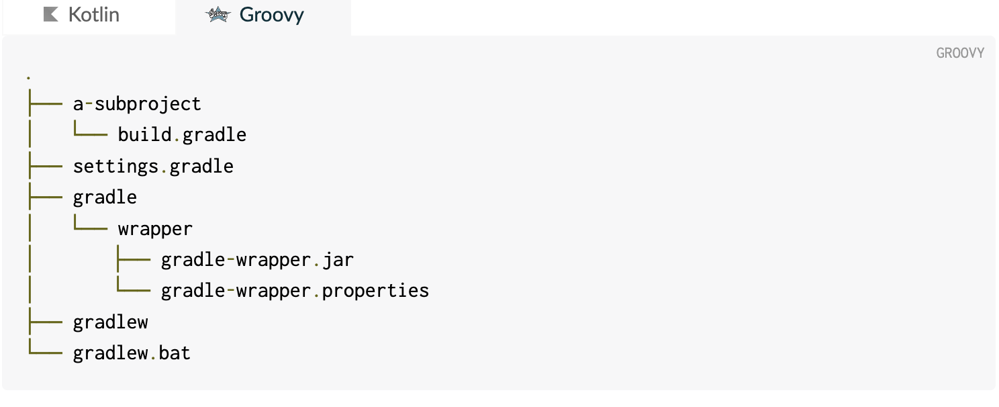

## Gradle
Gradle은 프로젝트를 빌드하고 관리하기 위한 오픈 소스 빌드 자동화 도구입니다. Groovy 또는 Kotlin을 기반으로 하는 DSL(Domain Specific Language)을 사용하여 빌드 스크립트를 작성하며, 안드로이드 애플리케이션부터 Java, Kotlin, 그루비 등의 프로젝트까지 다양한 유형의 프로젝트를 지원합니다.


* 특징
  * 유연성: Gradle은 Groovy나 Kotlin과 같은 DSL(Domain Specific Language)을 사용하여 빌드 스크립트를 작성할 수 있습니다. 이는 빌드 프로세스를 세밀하게 제어할 수 있도록 합니다.
  * 선언적 DSL: Gradle은 선언적 DSL을 사용하여 프로젝트의 의존성, 작업 등을 정의할 수 있습니다. 이는 빌드 스크립트를 간단하게 만들어 줍니다.
  * 멀티 프로젝트 지원: Gradle은 다중 프로젝트 구성을 쉽게 관리할 수 있는 기능을 제공합니다. 이를 통해 대규모 프로젝트의 빌드를 효율적으로 관리할 수 있습니다.
  * 자동 의존성 해결: Gradle은 프로젝트의 의존성을 자동으로 해결해주는 기능을 제공합니다. Maven과 유사한 방식으로 중앙 저장소에서 의존성을 다운로드하고 관리합니다.
  * 플러그인 생태계: Gradle은 다양한 플러그인을 제공하고 있으며, 커뮤니티에서도 다양한 플러그인을 제작하여 공유하고 있습니다. 이를 통해 빌드 프로세스를 확장하고 맞춤화할 수 있습니다.
* 장점
  * 성능: Gradle은 빌드 속도가 빠르고 효율적입니다. build incrementality 와 캐시 기능을 통해 반복 빌드 시간을 줄일 수 있습니다.
  * 유연성과 확장성: Gradle은 다양한 프로젝트에 유연하게 적용될 수 있습니다. 작은 프로젝트부터 큰 기업용 소프트웨어까지 다양한 요구 사항을 충족시킬 수 있습니다.
  * 커뮤니티 및 지원: Gradle은 활발한 커뮤니티와 다양한 문서, 튜토리얼, 그리고 지원을 제공합니다. 이는 사용자가 문제를 해결하고 지식을 공유하는 데 도움이 됩니다.
* 단점:
  * 학습 곡선: Groovy나 Kotlin에 익숙하지 않은 경우 초기 설정 및 스크립트 작성이 어려울 수 있습니다.
  * 설정의 복잡성: 복잡한 프로젝트 구성의 경우 Gradle 스크립트가 길고 복잡해질 수 있습니다.
  * 변화의 빈도: Gradle은 활발하게 업데이트되고 개선되는 도구이지만, 때로는 이로 인해 API 변경이나 호환성 문제가 발생할 수 있습니다.

## Gradle Wrapper (https://docs.gradle.org/current/userguide/gradle_wrapper.html)
Gradle 빌드 도구의 버전 관리와 프로젝트 환경 설정을 단순화하는 도구입니다. 이를 통해 개발자들은 Gradle을 미리 설치할 필요 없이 프로젝트에 포함된 Wrapper 스크립트를 실행하여 Gradle을 사용할 수 있습니다.
* 동작 
  * Wrapper 스크립트 설정: Gradle 프로젝트의 루트 디렉토리에는 Gradle Wrapper에 필요한 설정 파일인 gradle-wrapper.properties와 Wrapper 스크립트인 gradlew (또는 Windows에서는 gradlew.bat)가 포함되어 있습니다.
  * Gradle 다운로드: 처음 프로젝트를 빌드할 때 Wrapper 스크립트를 실행하면, 지정된 Gradle 버전이 현재 시스템에 설치되어 있는지 확인하고, 없다면 해당 버전의 Gradle을 인터넷에서 다운로드하여 프로젝트 디렉토리에 설치합니다.
  * 로컬 Gradle 사용: Gradle을 다운로드하고 설치한 후, Wrapper 스크립트는 해당 버전의 Gradle을 사용하여 프로젝트를 빌드하고 실행합니다.
* 장점
  * 버전 관리: Gradle Wrapper를 사용하면 프로젝트별로 Gradle 버전을 명시적으로 지정할 수 있습니다. 따라서 다른 프로젝트 간에 Gradle 버전 충돌을 방지할 수 있습니다.
  * 설치 필요 없음: 개발자들은 Gradle을 별도로 설치할 필요가 없습니다. 프로젝트에 포함된 Wrapper를 실행하면 자동으로 필요한 Gradle 버전이 다운로드되어 사용됩니다.
  * 초기 설정 간편화: 새로운 개발 환경에서 프로젝트를 시작할 때, Gradle Wrapper를 사용하면 Gradle을 설치하고 환경 설정을 할 필요 없이 바로 빌드할 수 있습니다.
  * 유지 보수 용이성: Gradle Wrapper를 사용하면 프로젝트를 공유하거나 이관할 때 Gradle 버전이 호환되는지 걱정할 필요가 없습니다. 모든 개발자가 동일한 Gradle 버전을 사용하여 일관된 개발 환경을 유지할 수 있습니다.

## Github 링크 : [SpringBoot Gradle 예제](https://github.com/devHjlee/Blog-Spring/tree/master/gradle)

### 예제

#### build.gradle (https://docs.spring.io/spring-batch/reference/job/running.html)

``` groovy    
// 외부 플러그인을 프로젝트에 적용하는 데 사용됩니다. 이 블록을 사용하여 프로젝트에 필요한 플러그인을 선언하고 버전을 지정할 수 있습니다.
// 각 플러그인은 고유한 id로 식별됩니다. java, org.springframework.boot, io.spring.dependency-management
plugins {
	id 'java'
	id 'org.springframework.boot' version '3.2.4'
	id 'io.spring.dependency-management' version '1.1.4'
}

group = 'com.gradle' // 프로젝트 그룹
version = '0.0.2-SNAPSHOT' // 프로젝트의 버전

java { // Java 소스코드의 호환성 버전 설정
	sourceCompatibility = '17'
}

// 프로젝트의 의존성을 해결하는 데 필요한 외부 저장소를 지정하는 데 사용됩니다.
// 프로젝트에서 사용되는 라이브러리 및 플러그인의 찾을 위치를 지정 합니다.
repositories {
	mavenCentral()
	google()
}

// 프로젝트가 의존하는 외부 라이브러리 및 모듈을 선언하는 데 사용됩니다.
// 이 블록은 프로젝트가 컴파일되고 실행될 때 필요한 다른 라이브러리들과의 의존성을 명시적으로 정의합니다.
dependencies {
	// implementation: 프로덕션 코드에 필요한 의존성을 정의합니다.
	implementation 'org.springframework.boot:spring-boot-starter-web'
	// compileOnly: 컴파일 시에만 필요한 의존성을 정의합니다. 런타임에는 필요하지 않습니다.
	compileOnly 'org.projectlombok:lombok'
	// runtimeOnly: 런타임 시에만 필요한 의존성을 정의합니다. 컴파일 시에는 필요하지 않습니다.
	runtimeOnly 'com.mysql:mysql-connector-j'
	// annotationProcessor: 어노테이션 프로세서 의존성을 정의합니다. 주로 롬복과 같은 라이브러리를 사용할 때 필요합니다.
	annotationProcessor 'org.projectlombok:lombok'
	// testImplementation: 테스트 코드에 필요한 의존성을 정의합니다.
	testImplementation 'org.springframework.boot:spring-boot-starter-test'
}

tasks.named('test') {
	useJUnitPlatform()
	println '실행 단계에서 마지막에 실행된다.'
}
```   


### 참고
* 공홈 : https://docs.gradle.org/current/userguide/userguide.html
* api implementaion 차이 : https://mangkyu.tistory.com/296
* task : https://velog.io/@hyemin916/Gradle%EC%97%90-%EB%8C%80%ED%95%B4-%EC%95%8C%EC%95%84%EB%B3%B4%EC%9E%90-2-Gradle-%EB%B9%8C%EB%93%9C-%EC%A7%9C%EB%B3%B4%EA%B8%B0