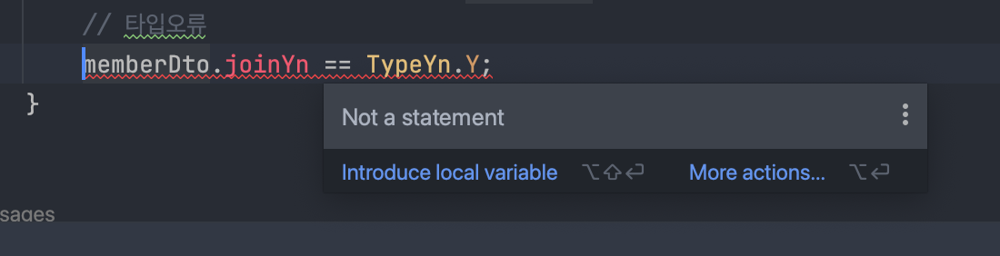

## 들어가며...
운영중인 시스템에서 최근들어 NullPointException이 자주 발생하였고 대부분이 Enum의 equals 였습니다.
원인은 DB 컬럼에 디폴트값 설정도 안되어 있는 컬럼과 특정 로직에서 그 컬럼을 Null로 업데이트를 하였고
비교로직에서는 memberDto.joinYn.equals(TypeYn.N) 형식으로 되어있어 발생 했습니다. 이미 턴키 프로젝트 개발자들은 다 떠난상태고 
소스레벨까지 제대로 체크하지 못한 죄도 있고... 이렇게 구현된 부분을 전체 수정할겸 어떤형식으로 하는게 좋을지 남기기위해 포스팅 합니다.

##### Enum
Enum은 Java에서 상수를 정의하는 특별한 형태의 클래스입니다. Enum 상수들은 클래스로 정의되어 있으며, JVM 메모리에는 다음과 같은 방식으로 로드됩니다.
1. 클래스 로드 및 정의
- Enum 클래스는 애플리케이션 실행 시 클래스 로더에 의해 로드됩니다. 클래스 로더는 Enum 클래스를 JVM 메모리에 로드하고, 클래스 정의를 통해 Enum 상수들이 정의됩니다.
2. 힙 영역에 상주
- 로드된 Enum 클래스와 그 안에 정의된 Enum 상수들은 힙(heap) 영역에 인스턴스로 생성됩니다. 이 인스턴스들은 프로그램의 수명 동안 메모리에 상주하며, 프로그램 전체에서 공유되어 사용됩니다.

## Enum Test
```java   
import org.junit.jupiter.api.Test;

import static org.assertj.core.api.Assertions.assertThat;
import static org.junit.jupiter.api.Assertions.*;

public class EnumEqualsNPETest {
    @Test
    void checkEnumNpe() {
        // given
        MemberDto memberDto = new MemberDto("memberA", null);

        // when then
        // 1.NPE 발생 현재 문제의 소스
        assertThrows(NullPointerException.class, () -> {memberDto.joinYn.equals(TypeYn.N);});
        // 2.NPE 피할수 있음
        assertThat(TypeYn.N.equals(memberDto.joinYn)).isEqualTo(false);
        assertThat(memberDto.joinYn == (TypeYn.N)).isEqualTo(false);

        // Equals 사용시 NPE는 피할수 있지만, 맞지 않는 타입에 대한 오류발견이 늦어 질 수 있음
        assertThat(YnTYpe.Y.equals(memberDto.joinYn)).isEqualTo(false);
        // 타입오류
        //memberDto.joinYn == TypeYn.Y;
    }
}

enum TypeYn {
    Y,N
}

enum YnTYpe {
    Y,N
}

class MemberDto {
    TypeYn joinYn;
    String name;

    public MemberDto(String name,TypeYn joinYn) {
        this.name = name;
        this.joinYn = joinYn;
    }
} 
```    


1. NPE 발생 (현재 문제점)
* 테스트 코드에서는 Enum 상수의 필드가 null인 경우, NullPointerException이 발생하는지를 확인합니다. 이는 Enum 상수의 필드가 null인 경우, 상수를 참조할 때 NullPointerException이 발생할 수 있기 때문입니다.
2. Enum 상수 비교
* 테스트 코드에서는 Enum 상수 간의 동등성(equality) 및 동일성(identity)을 비교합니다. Enum 상수의 동등성은 equals() 메서드를 사용하여 비교하고, 동일성은 == 연산자를 사용하여 비교합니다.
3. 유형 일치 확인 (최종 변경)
* 테스트 코드에서는 Enum 상수의 유형(Type)이 일치하지 않는 경우에 대한 검증도 수행합니다. 이는 다른 Enum 유형을 비교할 때 잘못된 타입이면 컴파일시점에 오류를 잡을 수 있습니다.
  


