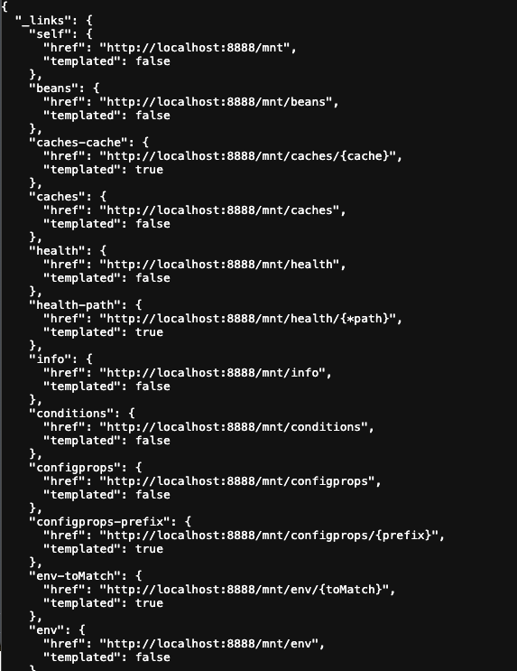
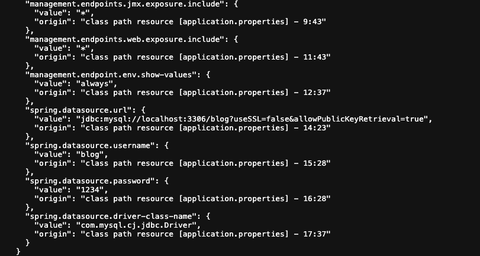
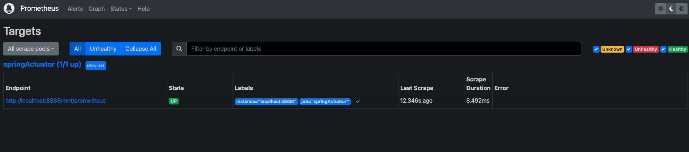
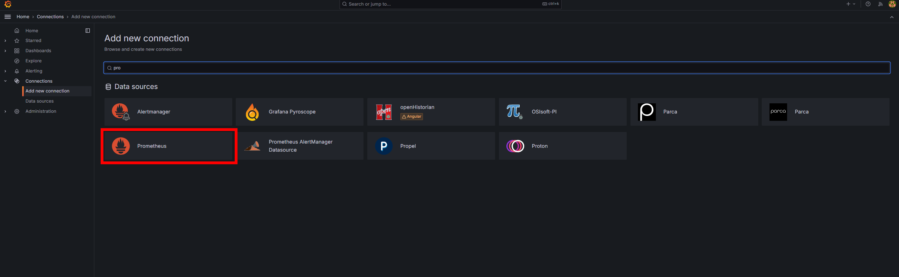
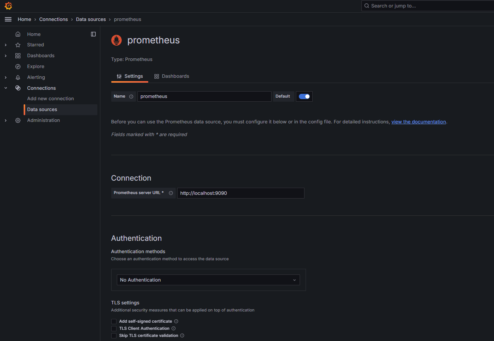
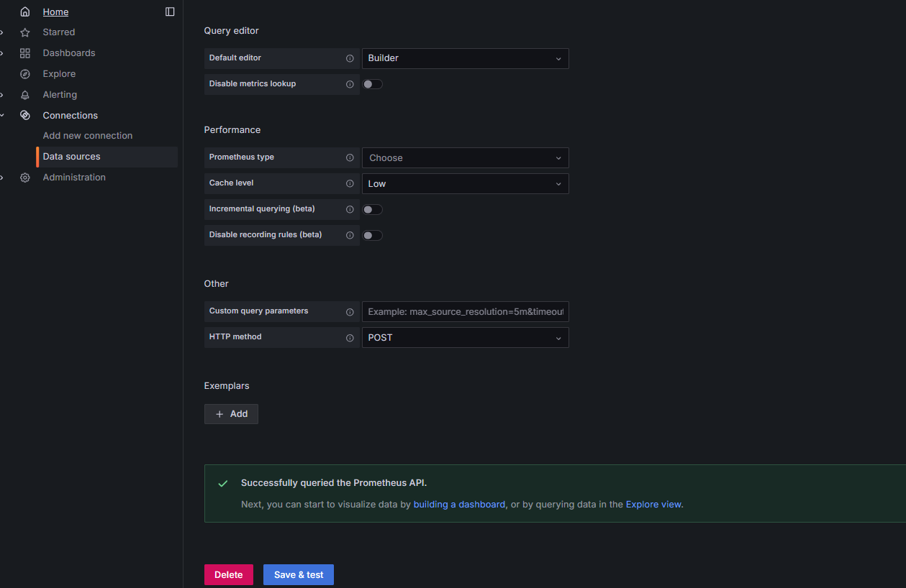
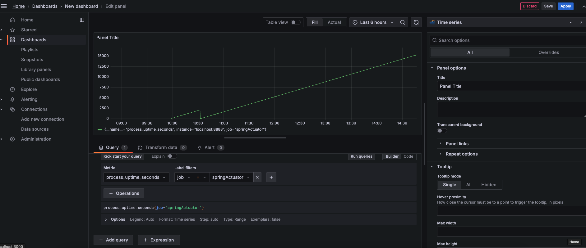
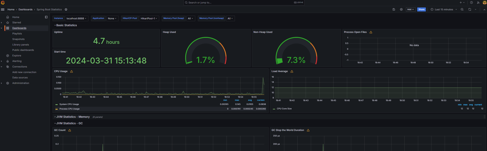

## 들어가며...
실무에서는 와탭과 같은 모니터링 솔루션을 도입하여 사용하고 있으나, 
Spring Boot로 구성한 개인 프로젝트에서는 모니터링을 위해 많이 사용되고 있다는 Spring Actuator + Prometheus + Grafana 조합으로 
적용 하면서 내용을 정리해 보기 위해 포스팅 합니다.
1. Spring Actuator 기본 설정 + Prometheus + Grafana 적용
2. Spring Actuator 보안 적용 (추후 작성 예정)

## Spring Actuator
Spring Actuator는 Spring Boot 애플리케이션의 모니터링과 관리를 간편하게 할 수 있는 기능을 제공합니다. 
이 기능은 애플리케이션의 상태를 실시간으로 추적하고, 메트릭을 수집하며, 다양한 관리 작업을 수행할 수 있도록 해줍니다. 

* 장점
  * 엔드포인트 제공: Spring Actuator는 여러 가지 엔드포인트를 제공하여 애플리케이션의 상태, 메트릭, 환경 설정 등에 대한 정보를 노출합니다. 예를 들어, /health, /info, /metrics, /env, /beans 등의 엔드포인트를 통해 다양한 정보를 확인할 수 있습니다.
  * 사용자 정의 엔드포인트: Actuator를 확장하여 사용자 정의 엔드포인트를 생성할 수 있습니다. 이를 통해 애플리케이션에 특화된 추가 정보를 노출하거나 관리 작업을 수행할 수 있습니다.
  * 실시간 메트릭 수집: Actuator는 애플리케이션의 다양한 메트릭을 실시간으로 수집합니다. CPU 사용량, 메모리 사용량, 요청 수 등의 정보를 제공하여 애플리케이션의 성능을 모니터링할 수 있습니다.
  * 보안 기능: Spring Actuator는 Spring Security와의 통합을 통해 엔드포인트에 대한 인증 및 권한 부여를 지원합니다. 이를 통해 액세스를 제어하고 보안 취약점을 최소화할 수 있습니다.
  * CSRF(Cross-Site Request Forgery) 보호: Actuator 엔드포인트는 기본적으로 CSRF 공격으로부터 보호됩니다. 이는 Spring Security의 CSRF 보호를 통해 구현됩니다.
  * 다양한 확장성: Actuator는 확장 가능한 구조를 가지고 있으며, 필요에 따라 사용자 지정 기능을 추가하여 확장할 수 있습니다.

* 단점
  * 기본 설정의 한계: Spring Actuator는 기본적으로 제공되는 엔드포인트가 있지만, 모든 애플리케이션에 완벽하게 맞지는 않을 수 있습니다. 특정한 요구사항이나 환경에 따라 추가적인 구성이 필요할 수 있습니다.
  * 보안 설정의 복잡성: Spring Actuator의 보안 설정은 강력하지만, 구성 및 관리가 복잡할 수 있습니다. 특히 엔드포인트에 대한 인증 및 권한 부여 설정을 유연하게 구성하려면 추가적인 작업이 필요할 수 있습니다.
  * 리소스 사용: Actuator를 사용하여 애플리케이션의 상태 및 메트릭을 모니터링하면 약간의 추가 리소스가 필요할 수 있습니다. 따라서 대규모 애플리케이션의 경우 이를 고려해야 할 수 있습니다.
  * 보안 취약성: Actuator 엔드포인트가 노출되는 경우, 악의적인 사용자에게 민감한 정보가 노출될 수 있습니다. 이에 대한 보안 대책을 취해야 합니다.

## Github 링크 : [SpringActuator 예제](https://github.com/devHjlee/Blog-Spring/tree/master/springBatch)
## 개발환경
* spring boot : 3.2.4
* OpenJdk 17
* Gradle 에 implementation 'org.springframework.boot:spring-boot-starter-actuator' 추가
* Prometheus
* Grafana

## SpringBoot Application.properties
``` properties    
# Actuator 관리용 서버 포트 설정
management.server.port=8888
# Actuator 엔드포인트의 기본 경로 설정
management.endpoints.web.base-path=/mnt
# JMX 노출 설정
management.endpoints.jmx.exposure.exclude=*
# 웹 엔드포인트 노출 설정
management.endpoints.web.exposure.include=*
# 환경 정보를 제공하는 엔드포인트
# 데이터베이스 비밀번호 또는 API 키와 같은 중요한 정보가 포함될 수 있습니다. 이러한 정보가 노출되면 보안 문제가 발생할 수 있으므로, 이 설정을 사용할 때에는 주의가 필요합니다.
management.endpoint.env.show-values=always
# 애플리케이션의 정보를 제공
management.endpoint.info.enabled=true
```    
* 각 개별 endpoint 활성화하거나 비활성화 하고 HTTP 또는 JMX를 통해 노출(원격 액세스 가능)할 수 있습니다.   
* 기본 제공 엔드포인트는 사용 가능한 경우에만 자동 구성됩니다. 
* 대부분의 애플리케이션은 설정한 엔드포인트 경로 (예시 /mnt) URL에 매핑되는 HTTP를 통한 노출을 선택합니다. 예를 들어 기본적으로 health엔드포인트는 에 매핑됩니다 /actuator/health.
* /mnt 로 접근시 acuator 설정에 맞춰 접근 가능한 URL을 보여줍니다. 현재는 예시를 위해 전부 노출해놨으나 각자 보안을 위해 설정을 변경해야 합니다.

* 보안의 예시로 위에 설정중 management.endpoint.env.show-values=always (default : never) 하고 /mnt/env 에 접근을 하면 환경설정으로 해놓았던 정보까지 전부 보여집니다.



## Prometheus (https://prometheus.io/docs/prometheus/latest/getting_started/)
Prometheus는 오픈 소스 시계열 데이터베이스 및 모니터링 시스템으로, 서버 및 애플리케이션의 성능 및 상태를 실시간으로 모니터링하고 경고를 생성하는 데 사용됩니다.

* 장점
  * 유연한 데이터 모델: 다차원 데이터 모델을 사용하여 데이터를 유연하게 조직하고 쿼리할 수 있습니다.
  * 강력한 쿼리 언어: PromQL은 데이터를 선택하고 집계하는 데 유용한 기능을 제공합니다.
  * 경량화: 프로메테우스는 경량화된 설계로 메모리 효율적인 모니터링을 가능하게 합니다.
  * 확장성: 수평 확장을 지원하여 대규모 환경에서도 사용할 수 있습니다.
  * Pull: Pull 방식의 구조를 채택해서 모든 메트릭 정보를 중앙 서버로 보내지 않아도 됩니다.
* 단점
  * 데이터 보존: 프로메테우스는 보존 정책에 따라 데이터를 보존하는데, 장기간 데이터 저장이 필요한 경우 추가 구성이 필요합니다.
  * 복잡한 설정: 초기 설정 및 구성은 다소 복잡할 수 있습니다.
  * 실시간 데이터 처리: 대규모 환경에서 실시간 데이터 처리에 제한이 있을 수 있습니다.


#### prometheus.yml 예시   
``` properties    
global:
scrape_interval: 15s

scrape_configs:
- job_name: "springActuator"
  static_configs:
  - targets: ["localhost:8888"]
    metrics_path: '/mnt/prometheus'
```    

위와 같이 설정 파일을 수정 후 프로메테우스 (localhost:9090)에 접근하여 연결한 서버의 상태 정보를 확인 할 수 있습니다.   



Actuator 에서 제공하는 /prometheus 엔드포인트를 통해 metirc 에 대한 정보를 수집합니다.

## Grafana
Grafana는 오픈 소스의 데이터 시각화 및 모니터링 도구로, 다양한 데이터 원본에서 데이터를 쿼리하고 시각적으로 표현하는 기능을 제공합니다.
* 장점
  * 사용자 친화적: Grafana는 직관적이고 사용하기 쉬운 사용자 인터페이스를 제공하여 사용자가 쉽게 대시보드를 만들고 시각화할 수 있습니다.
  * 다양한 데이터 소스 지원: InfluxDB, OpenTSDB, AWS CloudWatch, Azure Monitor, ElasticSearch 등 데이터 소스에서 데이터를 가져와 시각화할 수 있습니다.
  * 확장성: Grafana는 플러그인 시스템과 API를 통해 사용자가 시스템을 확장하고 사용자 정의할 수 있는 높은 확장성을 제공합니다.
  * 커뮤니티 및 지원: Grafana는 활발한 커뮤니티와 다양한 지원 자료를 통해 사용자들이 도움을 받을 수 있습니다.
* 단점
  * 학습 곡선: 복잡한 대시보드를 만들거나 고급 기능을 사용하려면 일정한 학습 곡선이 필요할 수 있습니다.
  * 리소스 사용량: 대규모 대시보드 또는 데이터 소스를 사용할 경우 Grafana가 많은 시스템 리소스를 사용할 수 있습니다.
  * 관리 및 유지보수: 대규모의 대시보드 및 데이터 소스를 관리하고 유지보수하는 것은 시간과 노력이 필요할 수 있습니다.

설치 후 첫 로그인시 admin / admin 을 입력 후 비밀번호룰 변경 해야합니다.

* Prometheus 연결 (인증에 대한 설정은 다음글에서...) 
* Add new connection 에서 Prometheus 를 선택 후 Prometheus 서버 정보 기입
     
   
   
* 메인에서 새 DashBoard 를 추가 후 Uptime 에 대한 metric 을 추가
   
* 개인 프로젝트에 필요한 템플릿을 다운받아 바로 연결을 할 수 있습니다.
   
### 참고
* https://docs.spring.io/spring-boot/docs/current/reference/html/actuator.html?query=health%27%20target=_blank%3E%3Cb%3Ehealth%3C/b%3E%3C/a%3E-groups#actuator.enabling
* https://docs.spring.io/spring-boot/docs/current/actuator-api/htmlsingle/#overview
* https://yjkim97.tistory.com/51 (Prometheus Config 설명)
* https://grafana.com/grafana/dashboards/