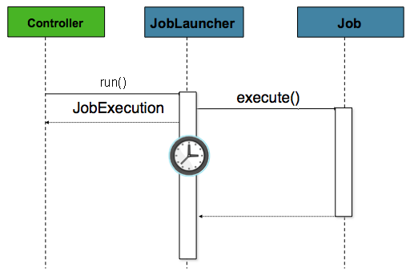

## Spring Batch
스프링 배치(Spring Batch)는 스프링 프레임워크 기반으로 개발된 배치 처리 프레임워크입니다. 배치 처리란 대량의 데이터를 일괄적으로 처리하는 작업을 말합니다. 
스프링 배치는 이러한 대량의 데이터를 처리하는데 필요한 모든 기능을 제공하여, 안정적이고 확장 가능한 배치 처리 시스템을 구축할 수 있도록 도와줍니다.   
또한, 기업 환경에서 대용량 데이터 처리 및 정기적인 배치 작업이 필요한 시스템에 쿼츠와같은 스케줄러와 함께 사용되고 있습니다.   

* 특징   
  * 단순한 설정: 스프링 배치는 스프링 프레임워크와 통합되어 있어서, 스프링의 IoC(Inversion of Control) 컨테이너와 의존성 주입(Dependency Injection) 등의 기능을 활용할 수 있습니다. 이를 통해 간단한 설정으로 배치 작업을 구성할 수 있습니다.
  * 확장성: 스프링 배치는 확장 가능한 아키텍처를 제공하여 대규모의 데이터 처리를 지원합니다. 작업을 분할하고 병렬로 실행하여 처리량을 증가시킬 수 있습니다.   
  * 재시도 및 복구 기능: 배치 작업 중에 오류가 발생할 경우에도 재시도 및 복구 기능을 제공하여 안정적인 처리를 보장합니다.
  * 모니터링과 관리: 스프링 배치는 배치 작업의 실행 상태를 모니터링하고 관리할 수 있는 기능을 제공합니다. 작업의 진행 상황을 추적하고 성능을 분석할 수 있습니다.
  * 다양한 리더와 라이터: 다양한 데이터 소스에서 데이터를 읽고 쓸 수 있는 유연한 리더와 라이터를 제공합니다. 이를 통해 다양한 데이터 형식과 데이터베이스를 처리할 수 있습니다.   
   
* 장점
  * 대용량 데이터 처리: 대량의 데이터를 효율적으로 처리할 수 있습니다.
  * 재사용성: 배치 작업의 로직을 모듈화하여 재사용할 수 있습니다.
  * 안정성: 오류 처리 및 복구 기능을 통해 안정적인 배치 작업을 보장합니다.
  * 관리 및 모니터링: 배치 작업의 실행 상태를 관리하고 모니터링할 수 있습니다.
* 단점
  * 학습 곡선: 스프링 배치를 사용하기 위해서는 스프링 프레임워크에 대한 이해가 필요합니다. 따라서 초기 학습 곡선이 존재할 수 있습니다.
  * 설정 복잡성: 복잡한 배치 작업을 구성할 때 설정이 복잡해질 수 있습니다.   
## SpringBatch 주요 단계
* Job (작업)
  * 스프링 배치에서 실행되는 하나의 배치 작업을 나타냅니다.   
  * Job은 여러 단계(Step)로 구성될 수 있습니다.   
   
* Step (단계)    
  * Job을 구성하는 하위 단위로, 실제로 작업을 수행하는 단계입니다.
  * 각 단계는 읽기(Read), 처리(Processing), 쓰기(Write) 단계로 구성될 수 있습니다.
    * Chunk 기반 스텝
      * Chunk 기반 스텝은 일괄 처리 작업을 아이템 단위로 처리하는 방식입니다.
      * 일정량(chunk size)의 아이템을 읽어와서 처리하고, 그 결과를 다시 저장합니다.
      * 일반적으로 대용량의 데이터를 처리할 때 사용됩니다.
      * Chunk 기반 스텝은 ItemReader,ItemProcessor,ItemWriter 로 구성됩니다.
        * ItemReader
          * Step에서 데이터를 읽어오는 역할을 합니다.
          * 다양한 데이터 소스에서 데이터를 읽어올 수 있습니다.
        * ItemProcessor
          * 읽어온 데이터를 가공하거나 필터링하는 역할을 합니다.
          * 선택적으로 사용될 수 있습니다.
        * ItemWriter
          * 처리된 데이터를 저장하거나 외부 시스템에 전달하는 역할을 합니다.
          * 처리된 아이템을 영속화하는 역할을 수행합니다.
    * Tasklet 기반 스텝:
      * Tasklet 기반 스텝은 단일한 작업(Tasklet)을 실행하는 방식입니다.
      * 간단하고 짧은 작업을 수행할 때 사용됩니다.
      * 예를 들어, 파일을 이동하거나, 데이터베이스에 저장 프로시저를 실행하는 등의 작업을 수행할 수 있습니다.

* JobLauncher (작업 실행기)
  * Job을 실행하는 역할을 합니다.
  * Job 실행 요청을 받아들이고, Job을 시작하며, Job 실행 상태를 추적합니다.
* JobRepository (작업 저장소):
  * 실행된 Job의 메타데이터를 저장하고 관리하는 역할을 합니다.
  * 스프링 배치의 내부 상태와 실행 이력을 관리합니다.
* JobInstance (작업 인스턴스):
  * 동일한 Job을 실행할 때 생성되는 하나의 인스턴스를 나타냅니다.
  * Job의 실행을 추적하고 관리하는 데 사용됩니다.
* JobExecution (작업 실행):
  * Job의 각 실행을 나타냅니다.
  * Job이 실행될 때마다 새로운 JobExecution이 생성됩니다.
  * JobExecution은 Job의 실행 상태와 결과를 포함합니다.
* StepExecution (단계 실행):
  * Step의 각 실행을 나타냅니다.
  * Step이 실행될 때마다 새로운 StepExecution이 생성됩니다.
  * StepExecution은 Step의 실행 상태와 결과를 포함합니다.
* ExecutionContext (실행 컨텍스트):
  * Job 또는 Step의 실행 중에 데이터를 공유하고 전달하기 위한 컨테이너입니다.
  * Job 또는 Step의 실행 도중에 데이터를 유지하고 전달하는 데 사용됩니다.

## SpringBatch 메타 테이블
   
https://docs.spring.io/spring-batch/reference/schema-appendix.html#exampleDDLScripts   
배치 작업 실행 및 상태 추적을 위해 여러 개의 테이블을 사용합니다. 이러한 테이블은 스프링 배치의 내부적인 상태를 저장하고, 작업의 실행 이력을 관리하는 데 사용됩니다.   
* BATCH_JOB_INSTANCE
  * Job의 실행 인스턴스를 나타내는 테이블입니다.
  * Job의 이름과 파라미터를 저장합니다.
  * Job 파라미터에 따라 각각의 JobInstance가 생성됩니다.
* BATCH_JOB_EXECUTION
  * Job의 실행 이력을 나타내는 테이블입니다.
  * Job이 실행될 때마다 새로운 레코드가 생성되며, 각 레코드는 하나의 JobExecution을 나타냅니다.
  * Job의 시작 및 종료 시간, 실행 상태 등의 정보를 저장합니다.
* BATCH_STEP_EXECUTION
  * Step의 실행 이력을 나타내는 테이블입니다.
  * Step이 실행될 때마다 새로운 레코드가 생성되며, 각 레코드는 하나의 StepExecution을 나타냅니다.
  * Step의 시작 및 종료 시간, 실행 상태 등의 정보를 저장합니다.
* BATCH_JOB_EXECUTION_CONTEXT
  * Job 실행 중에 ExecutionContext를 저장하는 테이블입니다.
  * Job이 실행될 때 생성되는 ExecutionContext의 내용을 저장합니다.
* BATCH_STEP_EXECUTION_CONTEXT
  * Step 실행 중에 ExecutionContext를 저장하는 테이블입니다.
  * Step이 실행될 때 생성되는 ExecutionContext의 내용을 저장합니다.
* BATCH_JOB_PARAMS
  * Job 파라미터를 저장하는 테이블입니다.
  * Job 실행 시 전달된 파라미터의 내용을 저장합니다.


## Github 링크 : [SpringBatch 예제](https://github.com/devHjlee/Blog-Spring/tree/master/springBatch)

## 개발환경
* spring boot : 3.2.3
* OpenJdk 17
* Mysql 8.0
* Spring Batch 5.1.1


## 프로젝트 구조


### 예제 소스

#### TestController (https://docs.spring.io/spring-batch/reference/job/running.html)    

``` java    
@RestController
@RequiredArgsConstructor
public class TestController {
    private final JobLauncher jobLauncher;
    private final JobRegistry jobRegistry;

    @RequestMapping("/test")
    public void test(@RequestParam String jobName,@RequestParam String reqDt) throws Exception {
        Job processJob = jobRegistry.getJob(jobName);
        JobParameters jobParameters = new JobParametersBuilder().addString("reqDt",reqDt).toJobParameters();

        jobLauncher.run(processJob, jobParameters);
    }
}
```   
       
* 스프링 배치를 실행하는 방법으로는 컨트롤러(Controller)를 활용하는 방법과 커맨드 라인(Command Line)을 통해 실행하는 방법이 있고 예시는 컨트롤러를 통해 구현했습니다.   

#### SimpleJobConfig (https://docs.spring.io/spring-batch/reference/step/tasklet.html)     
   
``` java    

@Slf4j
@Configuration
public class SimpleJobConfig {
    @Bean
    public Job simpleJob(JobRepository jobRepository, PlatformTransactionManager transactionManager) {
        return new JobBuilder("simpleJob", jobRepository)
                .start(simpleStepOne(null,jobRepository, transactionManager))
                .next(simpleStepTwo(jobRepository, transactionManager))
                .build();
    }

    @Bean
    @JobScope
    public Step simpleStepOne(@Value("#{jobParameters[reqDt]}") String requestDate, JobRepository jobRepository, PlatformTransactionManager transactionManager) {
        return new StepBuilder("simpleStepOne", jobRepository)
                .tasklet((StepContribution contribution, ChunkContext chunkContext) -> {
                    log.info(">>>>> This is simpleStepOne {}",requestDate);

                    return RepeatStatus.FINISHED;
                }, transactionManager)
                .build();
    }

    @Bean
    public Step simpleStepTwo(JobRepository jobRepository, PlatformTransactionManager transactionManager) {
        return new StepBuilder("simpleStepTwo", jobRepository)
                .tasklet((StepContribution contribution, ChunkContext chunkContext) -> {
                    log.info(">>>>> simpleStepTwo");

                    return RepeatStatus.FINISHED;
                }, transactionManager)
                .build();
    }
}
```    
   
* simpleJob: simpleJob이라는 이름의 Job 빈을 생성합니다. 이 Job은 JobBuilder를 사용하여 정의되며, 두 개의 Step으로 구성됩니다. start 메서드를 사용하여 첫 번째 Step을 정의하고, next 메서드를 사용하여 두 번째 Step을 연결합니다.
* simpleStepOne,Two: Step 빈을 생성합니다. 이 Step은 Tasklet 기반으로 동작하며, jobParameters[reqDt]를 사용하여 jobParameters에서 reqDt 값을 가져와서 사용합니다. 각 Step은 Tasklet을 실행하고 작업이 완료되면 RepeatStatus.FINISHED를 반환합니다.

## @JopScope   
* Job 내에서 한 번만 생성되며, Job이 실행될 때마다 새로운 인스턴스가 생성됩니다.   
* Job 내의 여러 Step에서 해당 빈을 공유하고자 할 때 유용합니다.    
## @StepScope   
* Step이 실행될 때마다 새로운 인스턴스가 생성됩니다.   
* 각 Step 내에서 해당 빈이 필요할 때마다 새로운 인스턴스를 생성하여 사용합니다.   
#### FlowJobConfig (https://docs.spring.io/spring-batch/reference/step/controlling-flow.html)   
``` java     
@Slf4j
@Configuration
public class FlowJobConfig {

    @Bean
    public Job flowJob(JobRepository jobRepository, Step stepOne, Step stepTwo, Step stepThree) {
        return new JobBuilder("flowJob", jobRepository)
                .start(stepOne)                             // StepOne으로 시작
                .on("*")                                    // 모든 결과에 대해서
                .to(stepTwo)                               // StepTwo로 이동
                .from(stepOne).on("FAILED").to(stepThree)  // StepOne이 실패한 경우에만 StepThree로 이동
                .end()                                     // Flow 종료
                .build();
    }

    @Bean
    @JobScope
    public Step stepOne(@Value("#{jobParameters[reqDt]}") String requestDate, JobRepository jobRepository, PlatformTransactionManager transactionManager) {
        return new StepBuilder("flowJob_stepOne", jobRepository)
                .tasklet((StepContribution contribution, ChunkContext chunkContext) -> {
                    log.info(">>>>> This is flowJob_stepOne {}",requestDate);

                    contribution.setExitStatus(ExitStatus.FAILED);

                    return RepeatStatus.FINISHED;
                }, transactionManager)
                .build();
    }

    @Bean
    @JobScope
    public Step stepTwo(@Value("#{jobParameters[reqDt]}") String requestDate, JobRepository jobRepository, PlatformTransactionManager transactionManager) {
        return new StepBuilder("flowJob_stepTwo", jobRepository)
                .tasklet((StepContribution contribution, ChunkContext chunkContext) -> {
                    log.info(">>>>> This is flowJob_stepTwo {}",requestDate);

                    return RepeatStatus.FINISHED;
                }, transactionManager)
                .build();
    }

    @Bean
    @JobScope
    public Step stepThree(@Value("#{jobParameters[reqDt]}") String requestDate, JobRepository jobRepository, PlatformTransactionManager transactionManager) {
        return new StepBuilder("flowJob_stepThree", jobRepository)
                .tasklet((StepContribution contribution, ChunkContext chunkContext) -> {
                    log.info(">>>>> This is flowJob_stepThree {}",requestDate);

                    return RepeatStatus.FINISHED;
                }, transactionManager)
                .build();
    }
}
```    

* Flow 설정
  * Job은 여러 개의 Step으로 구성됩니다. 각 Step은 특정 작업을 수행합니다.
  * start(stepOne)을 사용하여 flowJob이 StepOne으로 시작하도록 정의합니다.
* Step 간 흐름 설정
  * .on("*").to(stepTwo)는 StepOne이 성공한 경우에만 StepTwo로 이동하도록 설정합니다. 이는 StepOne의 실행 결과가 어떤 것이든 성공한 경우에 StepTwo로 흐름을 이동하게 됨을 의미합니다.
* 조건부로 Step 설정
  * .from(stepOne).on("FAILED").to(stepThree)은 StepOne이 실패한 경우에만 StepThree으로 이동하도록 설정합니다. 이는 StepOne의 실행 결과가 "FAILED"인 경우에만 StepThree으로 흐름을 이동하게 됨을 의미합니다.
  * .on("FAILED")은 StepOne의 실행 결과를 지정하는데, 여기서는 "FAILED"를 지정하여 StepOne이 실패한 경우에만 해당합니다.
* Flow 종료
  * .end()는 Flow 설정을 종료합니다.
이러한 설정을 통해 flowJob은 StepOne으로 시작하여 StepOne의 실행 결과에 따라 StepTwo 또는 StepThree으로 흐름이 이동합니다. StepOne이 성공한 경우에는 StepTwo로 이동하고, StepOne이 실패한 경우에는 StepThree로 이동합니다. 이런 방식으로 Flow를 사용하면 복잡한 작업 흐름을 구성할 수 있습니다.
    

## ItemReader, ItemWriter
#### ItemReader는 데이터 소스로부터 데이터를 읽어와서 스프링 배치의 처리 과정에 전달하는 역할을 합니다. 다양한 종류의 데이터 소스를 읽을 수 있고, 스프링 배치는 이러한 데이터 소스와 상호 작용할 수 있는 다양한 ItemReader 구현체를 제공합니다.
* 주요 기능
  * 데이터 읽기: 지정된 데이터 소스로부터 데이터를 읽어옵니다.
  * Chunk 단위로 데이터 읽기: 일정량의 데이터를 한 번에 읽어오는데, 이를 Chunk라고 합니다.
  * 페이징: 대량의 데이터를 효율적으로 처리하기 위해 페이징 기능을 제공합니다.
  * Transaction 관리: 데이터 읽기 작업을 트랜잭션 단위로 관리하여 데이터 일관성을 보장합니다.

#### ItemWriter는 스프링 배치의 처리 과정에서 생성된 데이터를 지정된 대상에 쓰는 역할을 합니다. 다양한 종류의 대상에 데이터를 쓸 수 있고, 스프링 배치는 이러한 대상과 상호 작용할 수 있는 다양한 ItemWriter 구현체를 제공합니다.
* 주요 기능
  * 데이터 쓰기: 지정된 대상에 데이터를 씁니다.
  * Chunk 단위로 데이터 쓰기: 일정량의 데이터를 한 번에 씁니다.
  * Transaction 관리: 데이터 쓰기 작업을 트랜잭션 단위로 관리하여 데이터 일관성을 보장합니다.

#### Database Reader Writer 종류
  * JpaPagingItemReader, HibernateCursorItemReader(Deprecated), StoredProcedureItemReader, JdbcCursorItemReader, JdbcPagingItemReader
  * JpaItemWriter, HibernateItemWriter(Deprecated), JdbcBatchItemWriter


#### JdbcJobConfig (https://docs.spring.io/spring-batch/reference/readers-and-writers/database.html)   

``` java     

@Slf4j
@Configuration
@RequiredArgsConstructor
public class JdbcJobConfig {
    private final DataSource dataSource;

    private static final int chunkSize = 10;

    @Bean
    public Job jdbcJob(JobRepository jobRepository, PlatformTransactionManager transactionManager, Step jdbcStep) {
        return new JobBuilder("jdbcJob", jobRepository)
                .start(jdbcStep)
                .build();
    }

    @Bean
    @JobScope
    public Step jdbcStep(@Value("#{jobParameters[reqDt]}") String requestDate, JobRepository jobRepository, PlatformTransactionManager transactionManager) {
        return new StepBuilder("jdbcStep", jobRepository)
                .<BatchDto,BatchDto>chunk(chunkSize,transactionManager)
                .reader(jdbcItemReader())
                .writer(jdbcItemWriter())
                .build();
    }

    @Bean
    @StepScope
    public JdbcCursorItemReader<BatchDto> jdbcItemReader() {
        return new JdbcCursorItemReaderBuilder<BatchDto>()
                .fetchSize(chunkSize)
                .dataSource(dataSource)
                .rowMapper(new BeanPropertyRowMapper<>(BatchDto.class))
                .sql("SELECT id, name FROM BATCH_TEST")
                .name("jdbcItemReader")
                .build();
    }

    @Bean
    public JdbcBatchItemWriter<BatchDto> jdbcItemWriter() {
        String sql = "UPDATE BATCH_TEST set name = ? where id = ?";
        return new JdbcBatchItemWriterBuilder<BatchDto>().dataSource(dataSource)
                .sql(sql)
                .itemPreparedStatementSetter((item, ps) -> {
                    ps.setString(1, "SYSTEM");
                    ps.setLong(2, item.getId());
                })
                .assertUpdates(true)
                .build();
    }

//    @Bean
//    public JdbcBatchItemWriter<BatchDto> jdbcItemWriter() {
//        String sql = "UPDATE BATCH_TEST set name = 'SYSTEM' where id = :id";
//        return new JdbcBatchItemWriterBuilder<BatchDto>().dataSource(dataSource)
//                .sql(sql)
//                .itemSqlParameterSourceProvider(new BeanPropertyItemSqlParameterSourceProvider<>())
//                .assertUpdates(true)
//                .build();
//    }

}
```    


* ItemReader 설정
  * jdbcItemReader 메서드는 JDBC를 사용하여 데이터를 읽는 JdbcCursorItemReader를 생성합니다.
  * SQL 쿼리를 사용하여 데이터를 조회하고, fetchSize를 통해 한 번에 가져올 데이터의 양을 설정합니다.
* ItemWriter 설정:
  * jdbcItemWriter 메서드는 JDBC를 사용하여 데이터를 쓰는 JdbcBatchItemWriter를 생성합니다.
  * SQL 쿼리를 사용하여 데이터를 업데이트하고, itemPreparedStatementSetter를 통해 PreparedStatement에 값을 설정합니다.
이러한 설정을 통해 스프링 배치를 사용하여 JDBC를 통해 데이터를 읽고 쓰는 배치 작업을 구성할 수 있습니다. 이러한 작업은 대량의 데이터를 처리하거나 주기적으로 반복되는 작업을 수행하는 데 유용합니다


#### CompositeJobConfig (https://docs.spring.io/spring-batch/reference/readers-and-writers/delegate-pattern-registering.html)
```java   
@Slf4j
@Configuration
@RequiredArgsConstructor
public class CompositeJobConfig {
    private final DataSource dataSource;

    private static final int chunkSize = 10;

    @Bean
    public Job compositeJob(JobRepository jobRepository, PlatformTransactionManager transactionManager, Step compositeStep) {
        return new JobBuilder("compositeJob", jobRepository)
                .start(compositeStep)
                .build();
    }

    @Bean
    @JobScope
    public Step compositeStep(@Value("#{jobParameters[reqDt]}") String requestDate, JobRepository jobRepository, PlatformTransactionManager transactionManager) {
        return new StepBuilder("compositeStep", jobRepository)
                .<MemberDto,MemberDto>chunk(chunkSize,transactionManager)
                .reader(compositeItemReader())
                .writer(compositeWriter())
                .build();
    }

    @Bean
    @StepScope
    public JdbcCursorItemReader<MemberDto> compositeItemReader() {
        return new JdbcCursorItemReaderBuilder<MemberDto>()
                .fetchSize(chunkSize)
                .dataSource(dataSource)
                .rowMapper(new BeanPropertyRowMapper<>(MemberDto.class))
                .sql("SELECT id, name, grade, mileage FROM MEMBER")
                .name("jdbcItemReader")
                .build();
    }

    @Bean
    @StepScope
    public CompositeItemWriter<MemberDto> compositeWriter() {
        final CompositeItemWriter<MemberDto> compositeItemWriter = new CompositeItemWriter<>();
        compositeItemWriter.setDelegates(Arrays.asList(updateGrade(),insertVIP()));
        return compositeItemWriter;
    }

    private CustomBatchItemWriter updateGrade() {
        String sql = "update MEMBER set grade = :grade where id = :id";

        JdbcBatchItemWriter<MemberDto> itemWriter = new JdbcBatchItemWriterBuilder<MemberDto>()
                .dataSource(dataSource)
                .sql(sql)
                .itemSqlParameterSourceProvider(new BeanPropertyItemSqlParameterSourceProvider<>())
                .build();

        return new CustomBatchItemWriter(itemWriter);
    }

    private ItemWriter<MemberDto> insertVIP() {
        String sql = "insert into VIP(id,name) values(:id, :name)";
        return items -> {
            JdbcBatchItemWriter<MemberDto> itemWriter = new JdbcBatchItemWriterBuilder<MemberDto>()
                    .dataSource(dataSource)
                    .sql(sql)
                    .itemSqlParameterSourceProvider(new BeanPropertyItemSqlParameterSourceProvider<>())
                    .build();

            itemWriter.afterPropertiesSet();
            itemWriter.write(new Chunk<MemberDto>(items.getItems().stream()
                    .filter(item -> item.getMileage() > 10000)
                    .collect(Collectors.toList()))
            );
        };
    }
}
```   
* CompositeItemWriter는 여러 개의 ItemWriter를 단일한 묶음으로 결합합니다.
* 하나의 ItemWriter 대신 여러 개의 ItemWriter를 실행하고자 할 때 사용됩니다.
* 복잡한 로직 분리
  * 여러 개의 ItemWriter를 CompositeItemWriter에 결합하여 복잡한 로직을 분리할 수 있습니다.
  * 각각의 ItemWriter는 서로 다른 로직 또는 데이터 저장소에 데이터를 쓰는 역할을 할 수 있습니다.   

#### CustomBatchItemWriter (https://docs.spring.io/spring-batch/reference/readers-and-writers/custom.html)
```java   
@Slf4j
@RequiredArgsConstructor
public class CustomBatchItemWriter implements ItemWriter<MemberDto> {

    private final JdbcBatchItemWriter<MemberDto> jdbcBatchItemWriter;

    @Override
    public void write(Chunk<? extends MemberDto> items) throws Exception {
        for (MemberDto memberDto : items.getItems()) {
            if (memberDto.getMileage() > 10000) {
                memberDto.setGrade("VIP");
            }
        }

        jdbcBatchItemWriter.afterPropertiesSet();
        jdbcBatchItemWriter.write(items);
    }
}
```   


### 참고
* https://github.com/spring-projects/spring-batch/tree/main/spring-batch-samples
* https://docs.spring.io/spring-batch/reference/spring-batch-intro.html