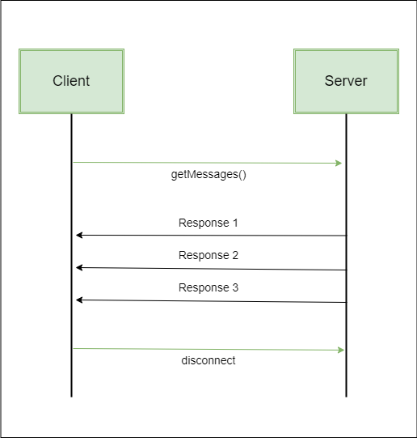
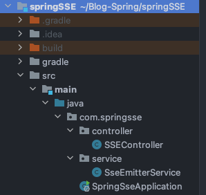
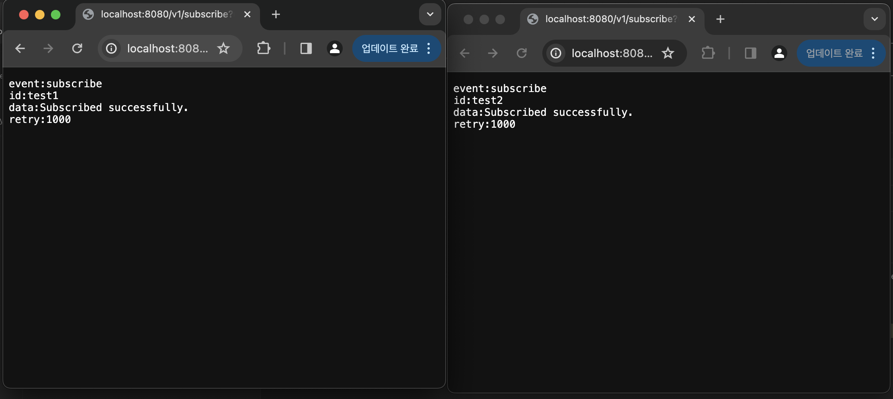
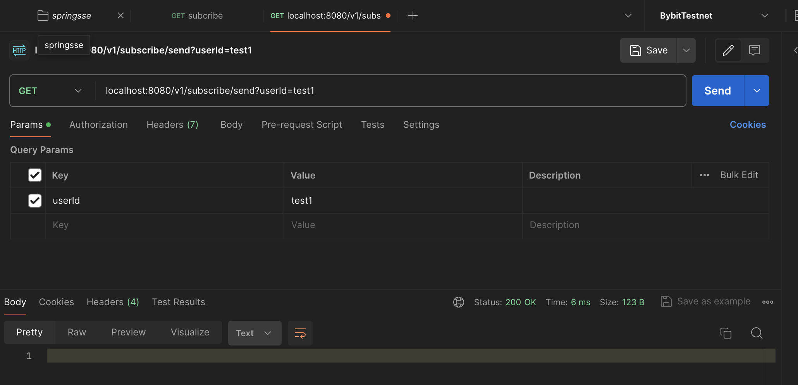
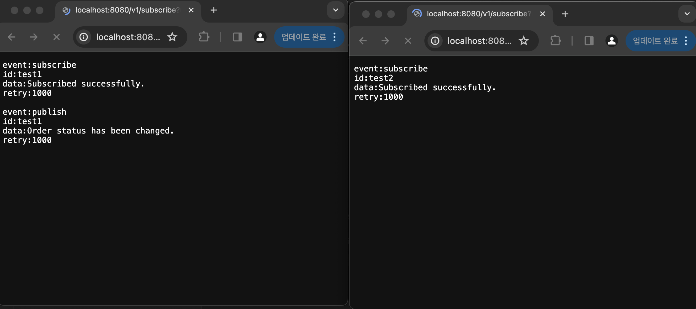

주문 프로젝트에서 고객이 웹에서 주문에 대한 상태변경을 실시간 알림으로 받기 위해 숏폴링으로 구축되어 있었고 불필요한 요청을 줄이기위해 SSE 와 웹소켓중 고민하다 SSE 를 진행하였고 
SSE에 대한 기술 포스팅입니다. (결국 웹소켓으로 변경...)    

* 롱 폴링(Long Polling)
  * 클라이언트가 서버에 데이터를 요청하면, 서버는 업데이트가 발생할 때까지 응답을 보류합니다.  업데이트가 발생하면 즉시 응답하고, 클라이언트는 다시 요청을 보내어 새로운 업데이트를 기다립니다.  이러한 방식은 폴링보다는 더 효율적으로 업데이트를 전달할 수 있지만, 여전히 서버에 부하가 발생할 수 있습니다.
* 숏 폴링(Short Polling)
  * 폴링과 롱 폴링의 중간 형태로, 클라이언트가 주기적으로 서버에 데이터를 요청하며, 서버는 즉시 응답합니다.롱 폴링보다는 더 빠른 업데이트를 제공할 수 있지만, 여전히 주기적인 요청이 발생하여 서버 부하가 발생할 수 있습니다.

#Server Sent Event    
SSE(Server-Sent Events)는 웹 애플리케이션에서 실시간 업데이트를 제공하는 데 사용되는 기술 중 하나입니다. 이 기술은 서버에서 클라이언트로 데이터를 비동기적으로 보내는 웹 기반의 통신 방식 중 하나로, 특히 단방향 통신에 적합합니다.   
SSE는 클라이언트에게 서버 측에서 이벤트를 전송하여 실시간으로 업데이트를 제공합니다. 이는 HTTP 프로토콜을 사용하며, 기본적으로 기존의 HTTP 연결을 통해 데이터를 전송하는 것과 달리, 오랜 시간 동안 연결을 유지하면서 데이터를 보내는 방식입니다.    
이로써 클라이언트는 서버로부터의 즉각적인 업데이트를 받을 수 있으며, 서버는 이벤트를 스트리밍하여 실시간으로 데이터를 전송할 수 있습니다. SSE를 사용하면 웹 애플리케이션에서 실시간 알림, 주식 시세 업데이트, 채팅 등 다양한 기능을 구현할 수 있습니다.    
또한, 이 기술은 WebSocket과 비교하여 더 간단한 구현과 더 큰 호환성을 제공하며, 일부 상황에서는 더 나은 성능을 보입니다.
Spring 프레임워크에서는 SSE를 지원하기 위한 간단한 API를 제공하며, 이를 통해 쉽게 SSE를 구현하고 사용할 수 있습니다. 주요한 클래스로는 SseEmitter가 있는데, 이를 사용하여 서버에서 이벤트를 생성하고 클라이언트로 전송할 수 있습니다.    



* 장점    
  * 간편한 사용: SSE는 WebSocket보다 더 간단하게 구현할 수 있으며, 또한 일부 사용 사례에서 WebSocket보다 더 적합할 수 있습니다.   
  * 웹 브라우저 호환성: 대부분의 최신 웹 브라우저에서 SSE를 지원하기 때문에, 호환성에 대한 걱정이 줄어듭니다.   
  * 서버 부하 감소: SSE는 HTTP 연결을 재사용하므로, WebSocket보다 서버 부하가 적을 수 있습니다.   

* 단점   
  * 단방향 통신: SSE는 서버에서 클라이언트로의 단방향 통신만을 지원하므로, 양방향 통신이 필요한 경우에는 WebSocket을 고려해야 합니다.
  * 폴링과 비교 시 지연: SSE는 주로 폴링과 비교되는데, 일정한 간격으로 데이터를 전송하므로 실시간성 측면에서 WebSocket보다는 지연이 발생할 수 있습니다.
  * 연결 유지: SSE는 연결을 유지하는 방식으로 동작하기 때문에, 연결이 많아지면 서버 측에서 관리해야 할 연결 수가 증가할 수 있습니다.

    
## 예제소스
### [https://github.com/devHjlee/devHjBlog/tree/main/springJpaBulk](https://github.com/devHjlee/Blog-Spring/tree/master/springSSE)

## 개발환경
* spring boot : 3.2.3
* OpenJdk 17
* org.springframework.boot:spring-boot-starter-web (SseEmitter)

## 프로젝트 구조   



### 예제 소스
#### 흐름 설명
* 사용자가 SSE를 구독하면 subscribe 메서드가 호출되어 해당 사용자를 위한 SseEmitter 객체를 생성하고 맵에 저장합니다.
* 사용자가 구독을 해지하면 onCompletion 핸들러가 호출되어 맵에서 해당 사용자의 SseEmitter 객체를 제거합니다.
* 서버에서 이벤트를 발생하면 publish 메서드가 호출되어 해당 사용자의 SseEmitter 객체를 찾아 이벤트를 전송합니다.
#### SseEmitterService
* subscribe   
  * 사용자가 SSE를 구독할 때 호출되는 메서드입니다. SseEmitter 객체를 생성하고, emitterMap에 저장합니다. 동시에 타임아웃 및 에러 핸들러를 등록하여 클라이언트와의 연결 관리를 수행합니다.
* publish
  * 사용자에게 실시간 이벤트를 발행할 때 호출되는 메서드입니다. emitterMap에서 해당 사용자의 SseEmitter 객체를 찾아 실시간 이벤트를 전송합니다.
* emitterMap
  * 특정 값(ex:userId)을 키로 하고 SseEmitter 객체를 값으로 갖는 ConcurrentHashMap입니다. 사용자의 구독 상태를 관리하며, 사용자가 구독을 해제할 때 이를 처리합니다.
* TIMEOUT, RECONNECTION_TIMEOUT
  * 각각 SSE 연결의 타임아웃 및 재연결 대기 시간   

``` java   

@Service
@Slf4j
public class SseEmitterService {
    private final Map<String, SseEmitter> emitterMap = new ConcurrentHashMap<>();
    private static final long TIMEOUT = 6000 * 1000;
    private static final long RECONNECTION_TIMEOUT = 1000L;

    public SseEmitter subscribe(String userId) {

        SseEmitter emitter = new SseEmitter(TIMEOUT);
        emitter.onTimeout(() -> {
            log.info("timed out : {}", userId);
            emitter.complete();
        });

        //에러 핸들러 등록
        emitter.onError(e -> {
            log.info("Error message : {}", e.getMessage());
            emitter.complete();
        });

        //SSE complete 핸들러 등록
        emitter.onCompletion(() -> {
            if (emitterMap.remove(userId) != null) {
                log.info("Remove userId :{}", userId);
            }
            log.info("disconnect usrId : {}", userId);
        });

        emitterMap.put(userId, emitter);

        try {
            emitter.send(sseEventBuilder("subscribe",userId,"Subscribed successfully.")); //503 방지를위한 더미데이터
        } catch (IOException e) {
            log.error("IOException : , {}", e.getMessage());
        }
        return emitter;
    }

    public void publish(String userId) {
        SseEmitter emitter = emitterMap.get(userId);
        if(emitter != null) {
            try {
                emitter.send(sseEventBuilder("publish",userId,"Order status has been changed."));
                log.info("publish userId : {}", userId);
            } catch (IOException e) {
                log.error("IOException : {}", e.getMessage());
            }
        }
    }

    private SseEmitter.SseEventBuilder sseEventBuilder(String name, String userId, String message) {
        return SseEmitter.event()
                .name(name) //이벤트 명
                .id(userId) //이벤트 ID
                .data(message) //전송 데이터
                .reconnectTime(RECONNECTION_TIMEOUT); // 재연결 대기시작
    }

}    
```     

#### SSEController
* 구독 및 구독자에게 메시지 발송     
``` java   

@RestController
@RequiredArgsConstructor
public class SSEController {

    private final SseEmitterService sseEmitterService;

    @GetMapping(path = "/v1/subscribe", produces = MediaType.TEXT_EVENT_STREAM_VALUE)
    public ResponseEntity<SseEmitter> subscribe(@RequestParam String userId) {
        SseEmitter emitter = sseEmitterService.subscribe(userId);
        return ResponseEntity.ok(emitter);
    }
    
    @GetMapping(path = "/v1/subscribe/send")
    public ResponseEntity<SseEmitter> test(@RequestParam String userId) {
        sseEmitterService.publish(userId);
        return ResponseEntity.ok().build();
    }
}   
```

#### Test 
* 브라우저에서 각각 UserID: test1, test2 로 /v1/subscribe 를 통해 구독
     

* /v1/subscribe/send 를 통해 test1 유저한테만 발행   
  

* test1 유저가 연결된 브라우저에만 실질적인 메시지가 전달
  


 
