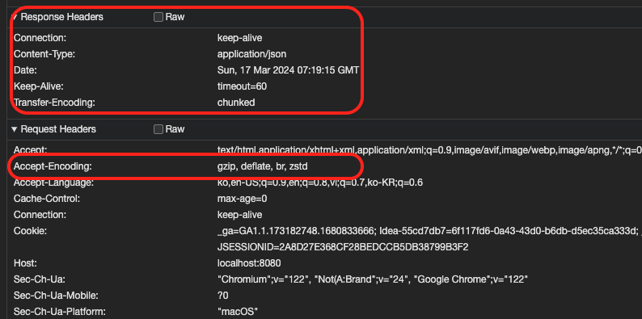
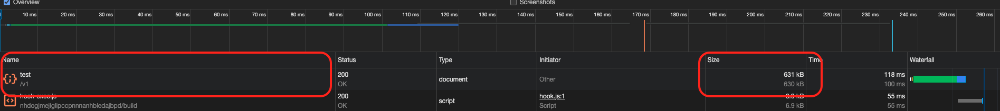
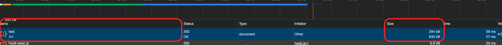
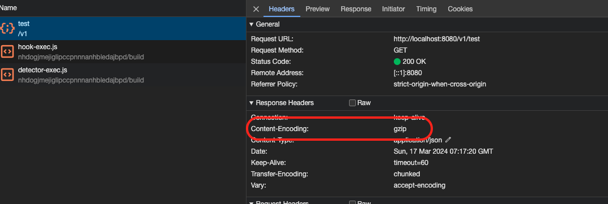

프론트 서버에서 백엔드 서버에 API를 요청시 헤더 설정에 Accept-Encoding: gzip 설정하여 요청을 하였지만 json 응답값이 gzip 으로 압축되지 않고 온다는 문의를 받았습니다.
gzip 압축... 그게 뭔지 모르니 우선 검색을 통해 알게 되었고 SpingBoot 에 적용 후, 개발 프론트 서버 + 로컬 백엔드와 연결하여 테스트 후 응답값이 정상적으로 gzip 으로 압축이 된걸 확인하고 배포하였지만 백엔드 개발 서버에서는 여전히 적용되지 않았습니다.
로컬은 내장톰캣,개발은 외장톰캣의 차이를 생각안하고 CloudFront, Nginx에도 설정도 변경...해봤으니 각각에 대해 설정하는 포스팅 입니다.


# gzip
데이터를 보다 효율적으로 전송하고 저장하기 위해 사용됩니다. 주로 웹 서버와 클라이언트 간의 HTTP 통신에서 사용되며, HTML, CSS, JavaScript 및 기타 웹 자원을 압축하여 전송하는 데 널리 사용됩니다.

* 장점
  * 대역폭 절약: gzip을 사용하면 데이터 크기가 줄어들어 네트워크 대역폭을 절약할 수 있습니다. 특히 대용량의 파일이나 대량의 데이터를 전송할 때 이점이 큽니다.
  * 빠른 전송: 데이터가 압축되면 전송 시간이 단축되므로 웹 페이지의 로딩 속도가 향상됩니다. 이는 사용자 경험을 향상시키고 SEO에도 도움이 됩니다.
  * 서버 부하 감소: 데이터가 압축되면 웹 서버에서 보낼 데이터 양이 줄어들어 서버의 부하가 감소합니다.   
   
* 단점
  * 압축 및 해제 오버헤드: gzip을 사용하면 데이터를 압축하고 해제하는 과정에 대한 오버헤드가 발생할 수 있습니다. 특히 압축 및 해제 프로세스가 복잡하고 시간이 많이 소요되는 경우에는 성능에 영향을 미칠 수 있습니다.
  * CPU 사용량 증가: 데이터를 압축하고 해제하는 과정은 CPU를 사용하므로 서버의 CPU 사용량이 증가할 수 있습니다. 특히 고트래픽 웹 서버에서는 이를 고려해야 합니다.


## Github 링크 : [SpringBoot gzip](https://github.com/devHjlee/devHjBlog/tree/main/springJpaBulk)

## 개발환경
* spring boot : 3.2.3
* OpenJdk 17
* org.springframework.boot:spring-boot-starter-web

## 프로젝트 구조



### 예제 소스
#### Spring Boot application.properteis

``` properties   

server.compression.enabled=true
server.compression.mime-types=application/json,application/xml,text/html,text/xml,text/plain
server.compression.min-response-size=1024
server.compression.excluded-user-agents=MSIE 6.0,UCBrowser   

```     

#### Nginx
* vi /etc/nginx/nginx.conf
``` properties   

#gzip  on;
gzip on;
gzip_min_length  10240;
gzip_buffers  32 32k;
gzip_comp_level 9;
gzip_types    text/plain application/x-javascript text/xml text/css application/json;
gzip_vary on;

```   

#### Tomcat
* vi server.xml
``` properties   

<Connector connectionTimeout="20000" port="8080" protocol="HTTP/1.1" redirectPort="8443"
    compressableMimeType="text/html,text/plain,text/css,text/javascript,application/javascript" 
    compression="on" 
    compressionMinSize="2048" 
/>

```   


#### Test
###### 적용 전 요청,응답값 헤더

     
  

###### 적용 후 요청,응답값 헤더   
  
     


 
